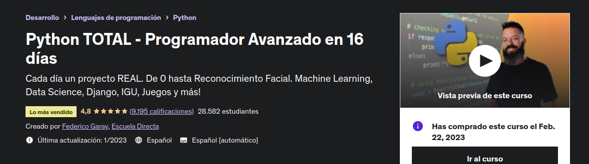
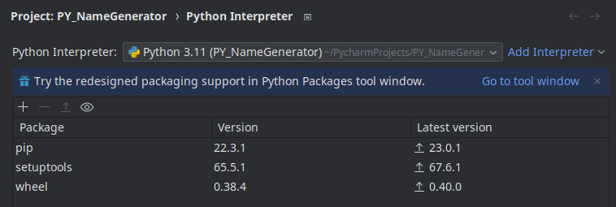
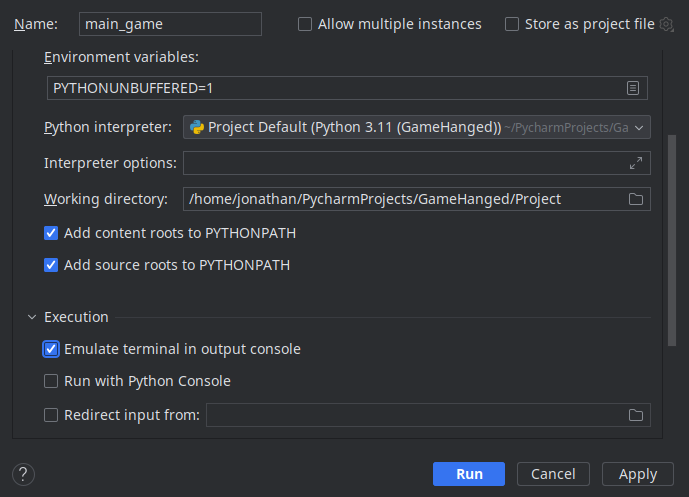
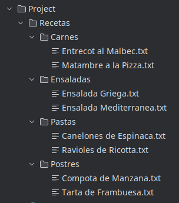
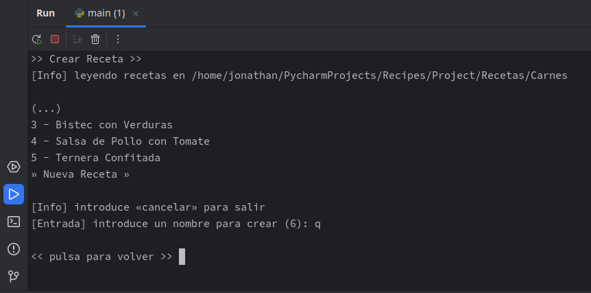
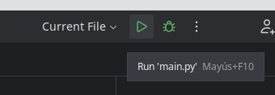

# Curso de Udemy





### Resumen de contenidos

- Desde el día 1 al día 6: **Entrenamiento básico.** Los conceptos fundamentales de Python para ser un programador robusto y con la base bien firme


- Desde el día 7 al día 9: **Fase avanzada.** Ingresa a la Programación Orientada a Objetos (OOP), para crear programas ágiles, sólidos, económicos, repetibles, y fáciles de mantener.


- Desde el día 10 en adelante: **Evoluciona a Experto.** Ya eres un programador avanzado de python, y ha llegado la hora de conocer sus principales aplicaciones en el mundo real. 
    
### Enlace
  https://www.udemy.com/course/python-total/

### Estadísticas

    Código: Python
    IDE: Pycharm (Linux)
    Idiomas: Español
    Subtítulos: Sí
    Clases: 244
    Vídeo: 30,5 horas en total
    Instructor: Federico Garay


## Sección 6: Programa un recetario

### Ejercicios
| Files Operations  | Path Methods | System Imports | 
|-------------------|--------------|----------------|


### Problemas
- Cuando se descarga el repositorio no se detecta el intérprete de Python.



- No funcionan los comandos de limpiar consola «debug config»



- Se puede refactorizar mejor el código «duplicaciones entre recetas y categorias»

```python
def show_recipes(list_recipes)
def show_categories(list_categories)
def show_recipes_short(list_recipes, *extra_info)
def show_categories_short(list_categories, *extra_info)
```

- En el caso de comprobar si existe ese archivo o carpeta, nuestro código es mejor porque no le importa si es mayúscula o minúscula. En Python existen funciones mucho más sencillas que no lo tienen en cuenta: 

```python
import os
os.path.exists(path)
```


### Proyecto
- Estructura de carpetas



- Ejecución desde la salida de la consola



### Instrucciones

- Instar última versíón de Python
- Instalar Pycharm IDE Community
-  Vincular cuenta de GitHub


